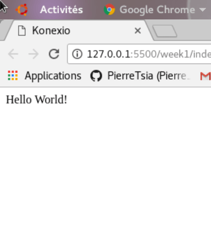
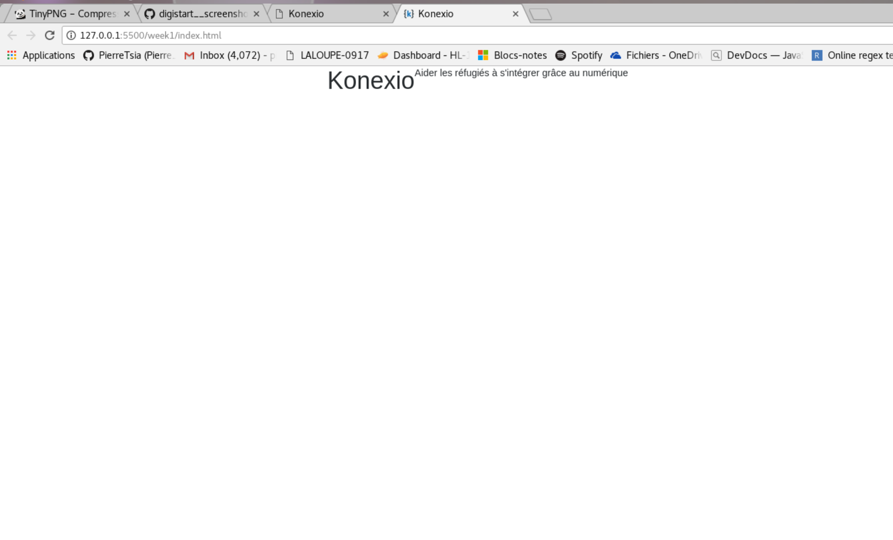
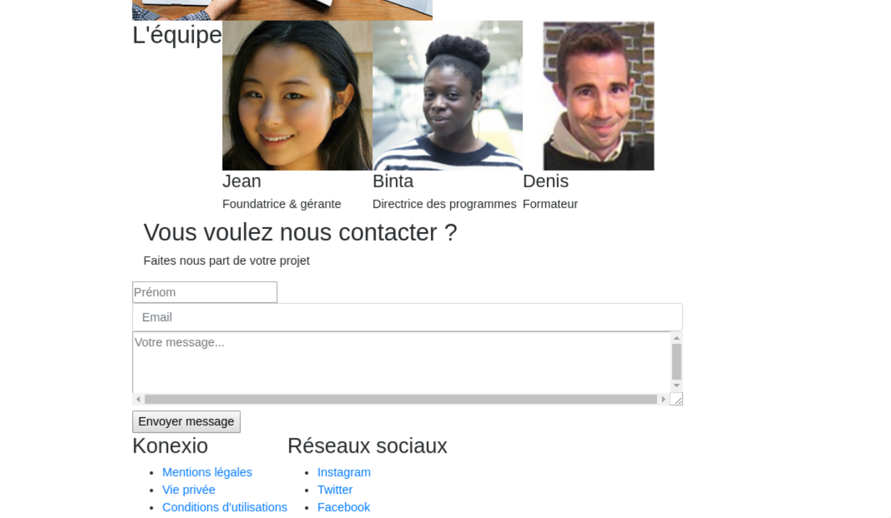

# Semaine 1 - HTML

[Instructions pour les professeurs](./teachers.md)

# Préparation

- Aller sur ce lien [https://github.com/konexio/digistart](https://github.com/konexio/digistart), cliquer sur le bouton vert `Cloner ou télécharger` puis cliquer sur le bouton `ZIP`
- Enregistrer le fichier dans le dossier `digistart` à l'intérieur du dossier `Konexio` sur le Bureau
- Décompresser le fichier
- Ouvrir votre éditeur de texte `VSCode`

  - Dans la barre des tâches utilisez `Fichier > Ouvrir un dossier`
  - Rechercher le dossier que vous venez de créer et cliquer sur le dossier `week1` puis cliquer sur `Ouvrir`

Votre dossier contient 4 dossiers et 2 fichiers, c'est normal.

# Structure de la page HTML

- Dans la barre des tâches de `VSCode` cliquer sur `Fichier > Nouveau fichier...` et nommer ce fichier `index.html`
- Cliquer sur le fichier dans la barre de gauche pour l'ouvrir
- Ecrire le doctype pour un fichier HTML5 sur la première ligne : `<!DOCTYPE html>`
- Sur la ligne suivante, écrire la balise `html` de la manière suivante :

<details>
    <summary>Solution</summary>

```html
<!DOCTYPE html>
<html></html>
```

</details>

La page HTML fonctionne comme des poupées russes. Il s'agit d'une suite de boîtes dans des boîtes.

- Ecrire dans l'élément `html` la balise `head`
- Après l'élément `head` mais toujours dans l'élément `html`, écrire la balise `body`
- Puis, dans l'élément `body` écrivez le texte : `Hello World!`

<details>
    <summary>👀 Solution</summary>

```html
<!DOCTYPE html>
<html>
  <head> </head>
  <body>
    Hello World!
  </body>
</html>
```

</details>

- Enfin, enregistrer le fichier en allant dans la barre de tâches de `VSCode` et cliquer sur `Fichier > Enregistrer`

## 💡 A savoir

- Une balise s'écrit toujours avec son nom. Prenons l'exemple de la balise `html`. Elle a une forme ouverte `<html>` et une forme fermée `</html>`.
  Donc la balise `body` s'écrira : `<body></body>`

- A l'intérieur d'une balise, on peut mettre du texte ou une autre balise

## 🔎 Vérification

Avant de passer à l'étape suivante, faire un clic-droit sur le fichier dans la fenêtre Windows et `Ouvrir avec...` le logiciel `Chrome`

Si vous voyez une page blanche avec le texte `Hello World!` en haut à gauche, alors vous avez réussi. Garder la fenêtre ouverte, on va la réutiliser constamment.
Sinon, appeler un formateur.

<details>
    <summary>✔ Checkpoint</summary>
    
</details>

# Remplir les métadonnées

Les informations dans l'élément `head` ne sont pas visibles dans la page mais sont utiles pour Google ou le navigateur.

- Dans l'élément `head`, créer la balise `title` avec pour contenu le texte `Konexio`

<details>
    <summary>Solution</summary>

```html
...
<head>
  <title>Konexio</title>
</head>
...
```

</details>

- Enfin, enregistrer le fichier en allant dans la barre des tâches de `VSCode` et cliquer sur `Fichier > Enregistrer`

## Vérification

Avant de passer à l'étape suivante, rafraîchir la page du navigateur `Chrome` et regarder le titre de l'onglet changer en `Konexio`

Sinon, appeler un formateur.

<details>
    <summary>✔ Checkpoint</summary>
    
</details>

# Bootstrap

Pour faciliter le travail du développeur, il existe des solutions qui aide à ordonner le code sans trop d'effort. C'est le cas de Bootstrap qui est un UI framework écrit en CSS.
En utilisant Bootstrap, on pourra utiliser et réutiliser les meilleures pratiques dans la création de site web.

Bootstrap est un fichier CSS différent du fichier HTML. Il faudra faire un lien pour inclure le fichier Bootstrap dans notre page HTML.

- Dans l'élément `head`

  - Créer une balise auto-fermante `link`
    - Créer l'attribut `rel` avec la valeur `stylesheet`
    - Créer l'attribut `href` avec la valeur `./css/bootstrap.min.css`

<details>
    <summary>Solution</summary>

```html
...
<head>
  <title>Konexio</title>
  <link rel="stylesheet" href="./css/bootstrap.min.css" />
</head>
...
```

</details>

## A savoir

- Une balise auto-fermante est une balise qui se ferme directement. Par exemple, la balise `img` est auto-fermante et s'écrit comme ça : ``
- Quand on parle de : "balise `div` avec l'attribut `class` de valeur `row`" alors vous devrez écrire `<div class="row"></div>`. Vous remarquerez que tous les attributs s'écrivent avec un `=""` et la valeur s'écrit entre les guillemets.
- Les chemins des fichiers sont relatifs au fichier qui les appelle. Ici, le fichier Bootstrap se trouve dans le dossier `css` qui est adjacent au fichier `index.html`

## Vérification

Avant de passer à l'étape suivante, rafraîchir la page et regarder si le texte `Hello World!` a changé de police d'écriture.
Sinon, appeler un formateur.

<details>
  <summary>✔ Checkpoint</summary>
  <br>
</details>

# La section entête

La page va contenir différentes sections : l'entête, les apprenants, les bénévoles, les EPN (Espaces Public Numériques) et l'équipe.
Dans un premier temps, nous allons définir les éléments principaux de ces pages.

- Dans l'élément `body`, effacer le texte `Hello World!`
- Toujours dans l'élément `body` créer une balise `section` avec l'attribut `id` de valeur `header`

  - Dans cet élément, créer une balise `div` avec l'attribut `class` de valeur `container`
    - Dans cet élément, créer une balise `div` avec l'attribut `class` de valeur `row`
      - Dans cet élément, créer une balise `h1` avec le texte `Konexio`
      - A la suite, créer une balise `p` avec le texte `Aide les réfugiés à s'intégrer grâce au numérique`

- Enfin, ajouter un commentaire `<!-- /section#header -->` juste après la balise fermante `</section>`

## A savoir

- On utilise l'attribut `id` pour un élément qui sera unique
- On utilise l'attribut `class` pour des éléments qui vont partager les mêmes attributs
- Quand on parle de : "balise `div` avec l'attribut `class` de valeur `row`" alors vous devrez écrire `<div class="row"></div>`. Vous remarquerez que tous les attributs s'écrivent avec un `=""` et la valeur s'écrit entre les guillemets.
- Un commentaire s'écrit toujours avec les caractères `<!-- -->` avec votre commentaire au milieu. Ce commentaire n'apparaîtra jamais sur votre page, il vous permet d'ajouter des informations pour expliquer votre code

## Vérification

Avant de passer à l'étape suivante, rafraîchir la page et vérifier que votre texte s'affiche bien et qu'il a une marge à gauche.
Sinon, appeler un formateur.

<details>
  <summary>✔ Checkpoint</summary>
  <br>
</details>

# La section "étudiants"

A la suite de la section de l'entête, on va reproduire la même structure à quelque chose près. Sauf pour l'`id` qui sera de valeur `students`

- Créer la balise `section` avec l'attribut `id` de valeur `students`
  - Dans cet élément, créer une balise `div` avec l'attribut `class`de valeur `container`
    - Dans cet élément, créer une balise `div` avec l'attribut `class` de valeur `row`
      - Dans cet élément, créer une balise auto-fermante `img` avec l'attribut `src` de valeur `./img/student.jpg` et l'attribut `alt` de valeur `Etudiant à Konexio`
      - A la suite, créer une balise `p` avec le texte `Apprenez à utiliser un ordinateur, les outils de bureautiques ou à programmer. Chacune de nos formations aboutit à une certification`
      - Créer une balise `button` avec le texte `Je veux étudier`
- Enfin, ajouter un commentaire `<!-- /section#students -->` juste après la balise fermante `</section>`

## A savoir

- Une balise auto-fermante est une balise qui se ferme directement. Par exemple, la balise `img` est auto-fermante et s'écrit comme ça : ``
- Les chemins des fichiers sont relatifs au fichier qui les appelle. Ici, le fichier Bootstrap se trouve dans le dossier `css` qui est adjacent au fichier `index.html`

* La balise `img` nécessite l'attribut `src` qui contient le chemin relatif vers l'image qui se trouve dans le dossier de votre ordinateur qui s'appelle aussi `img`.
* La balise `img` nécessite l'attribut `alt` qui contient un texte qui définit ce qu'il y a dans l'image. Cet attribut est obligatoire pour des raisons d'accessibilité.

## Vérification

Avant de passer à l'étape suivante, vérifier que :

- l'image apparaît,
- le texte est à la suite
- et qu'il y a un bouton à la fin

Sinon, appelez un formateur.

<details>
  <summary>✔ Checkpoint</summary>
  <br>
</details>

# La section "bénévoles"

A la suite de la section étudiants, reproduire la même structure jusqu'à la `div` de classe `row` mais avec l'`id` de valeur `volunteers`

- Ensuite, créer la balise `p` avec le texte `Vous avez envie d'aider des personnes qui cherchent à apprendre et à s'intégrer ? Si vous avez des connaissances en informatique de bureau, sur Excel ou en programmation, envoyez nous un message`
- Créer la balise `button` avec le texte `Je veux aider`
- Créer la balise `img` avec l'attribut `src` avec la valeur `./img/volunteer.jpg` et l'attribut `alt` avec la valeur `Professeur à Konexio`

## A savoir

- La balise `img` est toujours auto-fermante.

## Vérification

Avant de passer à l'étape suivante, vérifier que le paragraphe, le bouton et l'image apparaîssent.

<details>
  <summary>✔ Checkpoint</summary>
  <br>
</details>

# La section "EPN"

A la suite de la section bénévoles, reproduire la même structure jusqu'à la `div` de classe `row`, mais avec l'`id` `gallery`

- Ensuite, créer la balise `img` et afficher l'image qui se trouve dans le dossier `img`, puis dans le dossier `gallery` et avec le nom `gallery1.jpg`
- Créer 2 autres balises avec 2 autres images qui viennent du même dossier.

## A savoir

- Regarder la syntaxe des images précédentes pour comprendre comment afficher une nouvelle image.
- Ne pas oublier de mettre un commentaire à la fin de la section
- Ne pas oublier de mettre un attribut `alt` sur chaque image.

## Vérification

Avant de passer à l'étape suivante, vérifier que les 3 images apparaîssent les unes à côté des autres.
Sinon, essayer de trouver la solution par vous-même avant d'appeler un formateur.

<details>
  <summary>✔ Checkpoint</summary>
  <br>
</details>

# La section "équipe"

A la suite de la section "EPN", reproduire la même structure jusqu'à la `div` de classe `row` mais avec la `section` d'`id` de valeur `team`

- Ensuite, créer la balise `div` de classe `team-member`

  - Dans cet élément, créer une image avec la photo `jean.jpg` qui se trouve dans le dossier `img`, et ensuite dans le dossier `people`
  - Créer une balise `h4` avec son nom : `Jean Guo`
  - Créer une balise `h6` avec sa fonction : `Fondatrice et gérante`
  - Enfin, ajouter un commentaire pour montrer la fin de la `div` de classe `team-member`

- Reproduire cette structure :

  - avec la photo `binta.jpg` du même dossier
  - avec le nom `Binta Jammeh`
  - avec la fonction `Directrice des programmes`

- Reproduire cette structure à nouveau :
  - avec la photo `denis.jpg` du même dossier
  - avec le nom `Denis Robert`
  - avec la fonction `Formateur`

## Vérification

Avant de passer à l'étape suivante, vérifier que les 3 images s'affichent.

<details>
  <summary>✔ Checkpoint</summary>
  <br>
</details>

# Le pied de page

- Créer la balise `footer`
  - Dans cet élément, créer une `div` de classe `container`
    - Dans cet élément créer une `div` de classe `row`

### 1ère colonne

- A l'intérieur, créer une balise `div` de classe `footer-list`
  - Dans cet élément, créer une balise `h3` avec le texte `Konexio`
  - A la suite, créer une balise `ul`
    - Dans cet élément, créer une balise `li`
      - Créer une balise `a` avec l'attribut `href` de valeur `http://konexio.eu` et avec le texte `Mentions légales`
    - Créer cette même structure avec la balise `li` en changeant le texte de la balise `a` avec `Vie privée`
    - Et une dernière fois, avec le texte `Conditions d'utilisations`
- Penser à mettre un commentaire qui montre la fermeture de la colonne

### 2ème colonne

- Reproduire la même structure de balises utilisé pour la 1ère colonne à la suite. Penser à changer le titre avec `Réseaux sociaux` et les textes des ancres par `Instagram`, `Twitter` et `Facebook`. Garder les mêmes valeurs pour la balise `href` car ce n'est qu'un test

## A savoir

- La balise `a` signifie `ancre` c'est la balise qui représente un lien. Quand on clique dessus, vous irez sur le site de Konexio
- La balise `ul` (unordered list) aura toujours des balises `li` (list item) à l'intérieur.

## Vérification

Avant de finir la semaine 1, assurez-vous que tous vos textes s'affichent avec un fond bleu

<details>
  <summary>✔ Checkpoint</summary>
  <br>
</details>

# Les termes à retenir

Avant d'écrire du code, voici les points de vocabulaire à connaître :

## HTML

L'HTML est un langage informatique créé en 1990 au CERN. L'acronyme signifie HyperText Markup Language, ce qui signifie en français "langage de balisage d'hypertexte". Cette signification porte bien son nom puisqu'effectivement ce langage permet de réaliser de l'hypertexte à base d'une structure de balisage.

## CSS

Håkon Wium Lie a publié la première version du "Cascading HTML Style Sheets" en 1994 après avoir réalisé que l'HTML ne devait pas devenir un langage de description de page et qu'un mécanisme plus spécifique devait être mis en place.

## Balise

- quand on parle de : "balise `div`" alors on parle d'un élément HTML de nom `div` qui s'écrit en HTML : `<div>`. Vous devrez l'écrire dans votre code comme ci-suit : `<div></div>` car toute balise ouverte doit être fermée, comme une boîte.
- quand on parle de : "balise auto-fermante `img`" alors on parle d'un élément HTML de nom `img` qui s'écrit comme ça : ``
- les mots `balise` et `élément` sont équivalents en HTML.

## Attribut

- quand on parle de : "balise `div` avec l'attribut `class` de valeur `row`" alors vous devrez écrire `<div class="row"></div>`. Vous remarquerez que tous les attributs s'écrivent avec un `=""` et la valeur s'écrit entre les guillemets.
- quand on parle de : "balise auto-fermante `img` avec l'attribut `src` avec la valeur `./img/volunteers.jpg`", alors vous devez écrire ``.

# Bonus

Vous avez tout fini ? Vous voulez un challenge de plus ?

## Bonus 1 : Favicon

Le favicon est la petite icone dans l'onglet du navigateur à côté du titre.
Pour ajouter un favicon, rechercher sur Google `how to add favicon in html`. Cliquez et lisez les premiers liens jusqu'à ce que vous vous sentiez à l'aise avec le concept.

Une fois prêt(e), ajouter le favicon qui se trouve dans le dossier `img` avec le nom `favicon.ico`

<details>
  <summary>✔ Checkpoint</summary>
  <br>
</details>

## Bonus 2 : Formulaire de contact

Essayer de reproduire le formulaire de contact. Pour le recréer, vous aurez besoin des balises déjà utilisées et des balises `input` et `textarea`. Bonne chance !

<details>
  <summary>✔ Checkpoint</summary>
  <br>
</details>
