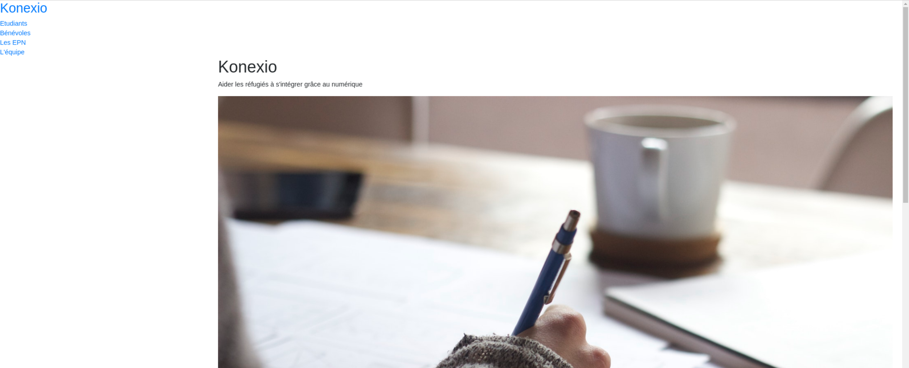
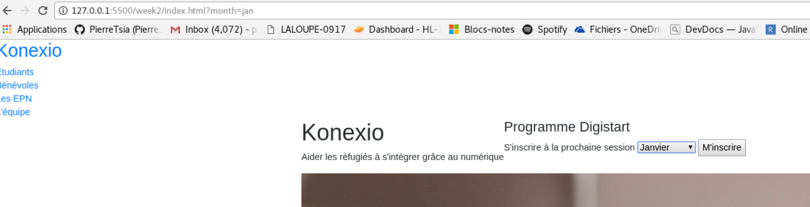
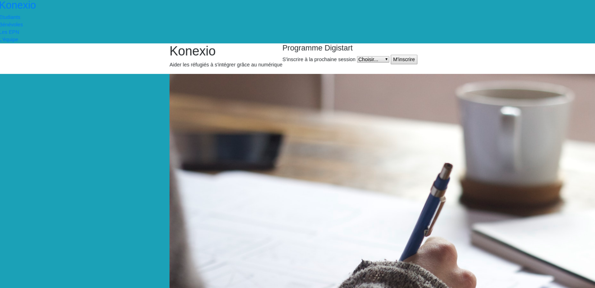
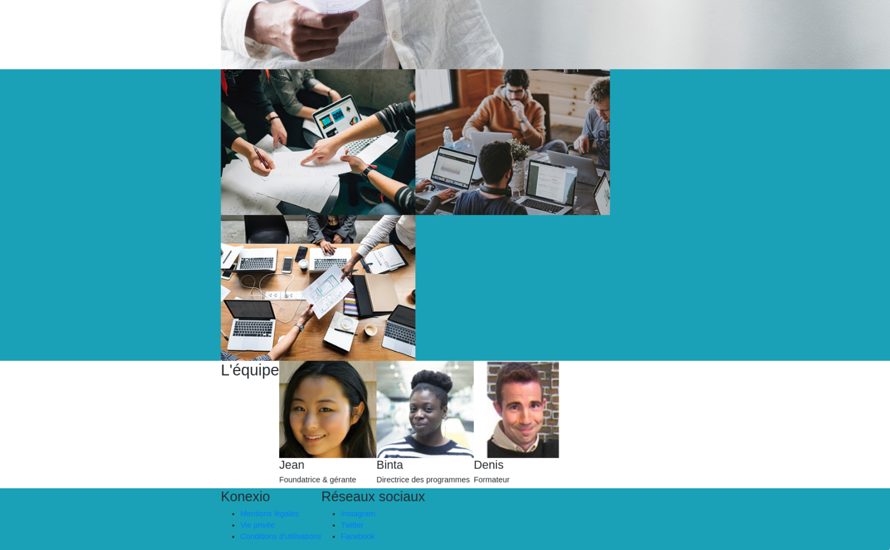
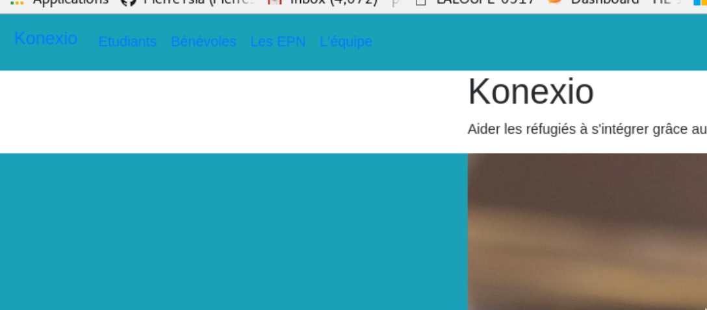
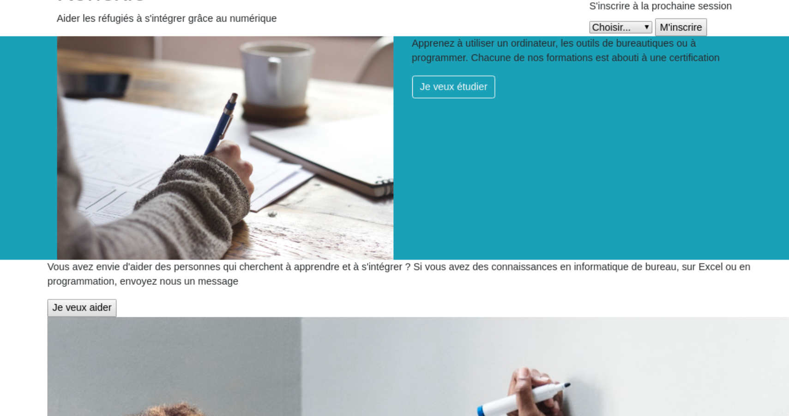
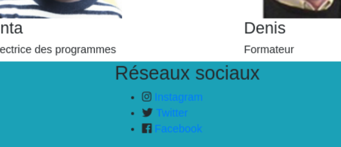
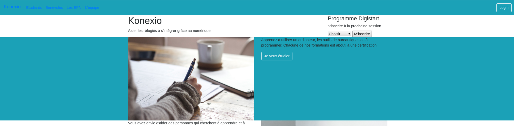

# Semaine 2 - Bootstrap

[Instructions pour les professeurs](./teachers.md)

# Préparation

- Si vous avez réussi la trame principale la semaine dernière, ouvrir le fichier `index.html` dans le dossier `week1`
- Sinon, ouvrir le fichier `index.html` dans le dossier `week2`

* Dans la barre des tâches utilisez `Fichier > Ouvrir un dossier`
* Rechercher le dossier que vous venez de créer et cliquer sur le dossier ci-dessus puis cliquer sur `Ouvrir`

# La navigation

## A savoir

- Une ancre qui appelle un `id` va permettre de scroller directement sur la page à l'endroit où se trouve cet attribut `id`

## Instructions

Maintenant que vous êtes à l'aise avec l'écriture de l'HTML et que la structure est présente, on va revenir en haut de la page pour ajouter la barre de navigation

- Ajouter la balise `nav` entre la balise d'ouverture `body` et la balise d'ouverture `section` avec l'`id` `header`
  - Dans cet élément, créer une ancre avec le texte `Konexio` et l'attribut `href` avec la valeur `#header`, l'ancre sera elle-même dans une balise `h2`
  - Créer une balise `ul` dans laquelle il y aura 4 fois :
    - une balise `li` avec une ancre à l'intérieur
      - chaque ancre aura le texte `Etudiants`, `Bénévoles`, `Les EPN`, `L'équipe`
      - chaque ancre aura un attribut `href` avec l'`id` de la section qu'il appelle précédé d'un dièse (hashtag). Par exemple, l'ancre avec le texte `Etudiants` aura un attribut `href="#students"`

## Vérification

Avant de passer à l'étape suivante, vérifier que les liens redirigent tous sur la section désirée.

    
✔ Checkpoint

    

# Formulaire

## A savoir

- Le formulaire est une balise qui permet au visiteur d'effectuer des actions sur le site.

## Instructions

On va finir encore un peu d'HTML cette semaine avant de commencer le CSS.

- Dans la section entête avec l'`id` `header`, ajouter la balise `aside` en dessous de la balise `p`

  - Dans cet élément, créer une balise `form` avec l'attribut `action` de valeur `index.html`
    - Dans cet élément, créer une balise `h4` avec le texte `Programme Digistart`
    - A la suite, créer une balise `label` avec le texte `S'inscrire à la session`
    - A la suite, créer une balise `select` avec l'attribut `name` de valeur `month`
    - Ensuite, une balise `button` avec le texte `M'inscrire` et l'attribut `type` de valeur `submit`

- Dans la balise `select`
  - Créer une balise `option` avec le texte `Choisir` et l'attribut `value` qui est vide
  - Créer 4 balises `option` avec le texte et l'attribut `value` de valeur `Janvier`, `Mars`, `Juin`, `Septembre`

## Vérification

Avant de passer à l'étape suivante, vérifier qu'après avoir sélectionné un mois et après avoir cliqué sur `M'inscrire` que la page a été rafraîchie et que le lien a changé avec la valeur `?month=Janvier` (si vous avez sélectionné `Janvier`)

    
✔ Checkpoint

    

# Attention

Pendant toutes les étapes de cette semaine, penser à rafraîchir la page à chaque fois que vous ajoutez une classe. Cela permettra de comprendre comment une classe modifie votre élément.

# Habillage

## A savoir

- Quand on cherche un élément et que la page devient longue, pensez à utiliser la fonction de recherche `ctrl+f`

## Instructions

Bootstrap est inclus dans la page (depuis la semaine dernière), maintenant on va rajouter un peu de couleurs à notre page.

- Rajouter la classe `bg-info` aux éléments suivants :
  - l'élément `nav` (pour trouver l'élément, faire `ctrl+f` et taper `<nav>`)
  - la section avec l'`id` `students` (faire `ctrl+f` et taper `id="students"`)
  - la section avec l'`id` `gallery` (faire `ctrl+f` et taper `id="gallery"`)
  - l'élément `footer` (faire `ctrl+f` et taper `<footer>`)

## Vérification

Avant de passer à l'étape suivante, regardez si les éléments changés ont un fond bleu ciel.

    
✔ Checkpoint

    
    

# Bootstrapiser la navigation

## A savoir

- L'attribut `class` peut contenir plusieurs classes séparés par des espaces. Par exemple si on a un élément `

` et que l'on veut lui rajouter une classe, alors on écrira `

`

## Instructions

Bootstrap est rempli de règles CSS pour rendre la page plus belle. Ici, on va se concentrer sur la navigation.

Dans l'élément `nav`

- Ajouter les classes `navbar`, `navbar-expand-lg`
- Dans l'ancre qui contient le titre `Konexio`, ajouter la classe `navbar-brand`
- Dans l'élément `ul`, ajouter la classe `navbar-nav`
  - Sur chaque élément `a`, ajouter la classe `nav-link`

## Vérification

Avant de passer à l'étape suivante, regarder si le titre est en gras et que les liens du menu sont espacés.

    
✔ Checkpoint

    

# Structurer l'entête

## A savoir

- La classe `row` que l'on a beaucoup écrit la semaine dernière est une classe Bootstrap qui définit une ligne. Une ligne contient 12 colonnes. Donc pour faire une ligne, ajouter des classes qui font un total de 12. Par exemple:
  - 2 éléments avec les classes `col-6`
  - 3 éléments avec les classes `col-4`
  - etc...

## Instructions

Dans l'élément `section` avec l'id `header`

- Ajouter une balise `div` qui va entourer les éléments `h1` et `p`
  - Sur cet élément, ajouter la classe `col-9`
- Ajouter la classe `col-3` sur l'élément `aside`

## Vérification

Avant de passer à l'étape suivante, regarder si les titres `Konexio` et `Programme Digistart` sont dans deux colonnes séparés et que le formulaire soit dans le coin droit.

    
✔ Checkpoint

    

# Structurer la section "étudiants"

## A savoir

- La classe `img-fluid` permet aux images (uniquement) de prendre tout l'espace dans la colonne où elle se trouve

## Instructions

Dans l'élément `section` d'id `students`

- Entourer l'image avec une balise `div` de classe `col-6`
- Sur l'image, ajouter la classe `img-fluid`
- Entourer le paragraphe et le bouton avec une balise `div` de classe `col-6`
- Sur le bouton, ajouter les classes `btn` et `btn-outline-light`

## Vérification

Avant de passer à l'étape suivante, regarder si l'image et le texte sont dans deux colonnes différentes.

    
✔ Checkpoint

    

# Stucturer la section "bénévoles"

Dans l'élément `section` d'id `volunteers`

- Entourer le paragraphe et le bouton avec une balise `div` de classe `col-6`
- Ajouter au bouton les classes `btn` et `btn-outline-dark`
- Entourer l'image d'une balise `div` de classe `col-6`
- Ajouter la classe `img-fluid` à l'image

## Vérification

Avant de passer à l'étape suivante, regarder que l'image et le texte sont sur deux colonnes différentes.

    
✔ Checkpoint

    

# Structurer la galerie

## A savoir

- Les classes `offset-n` où `n` est un nombre entre 1 et 12 sont des classes pour mettre un espace à gauche entre 2 colonnes.

## Instructions

Dans l'élément `section` d'id `gallery`

- Entourer les images dans une balise `div` de classes `col-4` et `offset-4`

# Structurer la section "équipe"

Dans l'élément `section` d'id `team`

- Ajouter une balise `h2` juste après la balise d'ouverture de classe `row`
  - Dans cet élément, ajouter le texte `L'équipe`
- Entourer la balise `h2` avec une balise `div` de classe `col-12`
- Ajouter une classe `col-4` à toutes les `div` de classe `team-member`

## Vérification

Avant de passer à l'étape suivante, regarder si les images sont sur la même ligne.

    
✔ Checkpoint

    

# Structurer le pied de page

Dans l'élément `footer`

- Ajouter les classes `col-6` aux éléments `div` de classe `footer-list`

## Vérification

Avant de passer à l'étape suivante, regarder si les textes sont sur deux colonnes différentes.

    
✔ Checkpoint

    

# Les icônes

Dans l'élément `head`

- Créer une balise auto-fermante `link`

  - Créer l'attribut `rel` avec la valeur `stylesheet`
  - Créer l'attribut `href` avec le chemin relatif du fichier qui s'appelle `all.min.css` dans le dossier `css`

Dans l'élément `footer`

- Dans les ancres, ajouter des balises `i` avec la classe `fab` dans la 2è colonne
  - Et pour chaque balise `i`, ajouter la classe `fa-instagram`, `fa-twitter` et `fa-facebook`

## Vérification

Avant de finir la semaine, regarder si les icônes apparaissent.
Sinon, appeler un formateur.

    
✔ Checkpoint

    

# Les termes à retenir

## Framework

Un framework, encore appelé "structure logicielle" en français, établit les fondations d'un logiciel ou son squelette applicatif. Il permet d'accéler et de standardiser le développement d'une application.

# Bonus

# Bonus #1 : Bouton de login

Ajouter un bouton de login sur la droite dans la barre de navigation. Pour y arriver, utiliser la documentation bootstrap [https://getbootstrap.com/docs/4.1/components/navbar/#forms](https://getbootstrap.com/docs/4.1/components/navbar/#forms)

    
✔ Checkpoint

    

